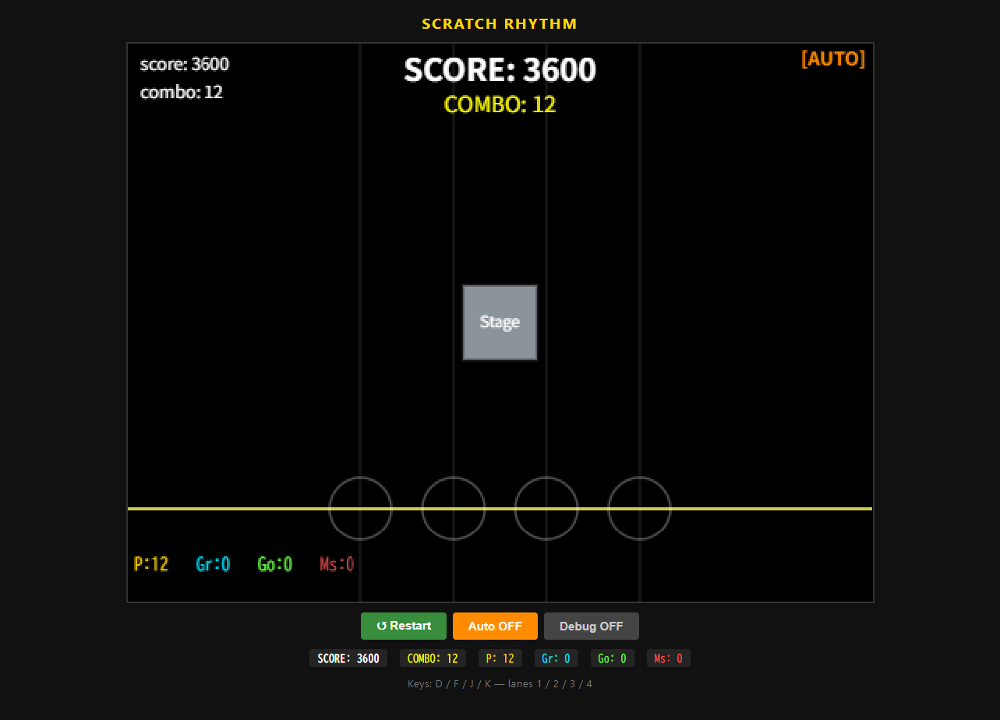
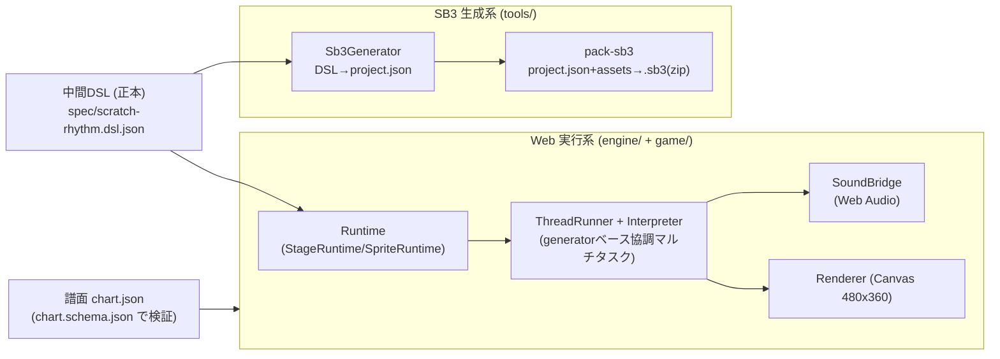
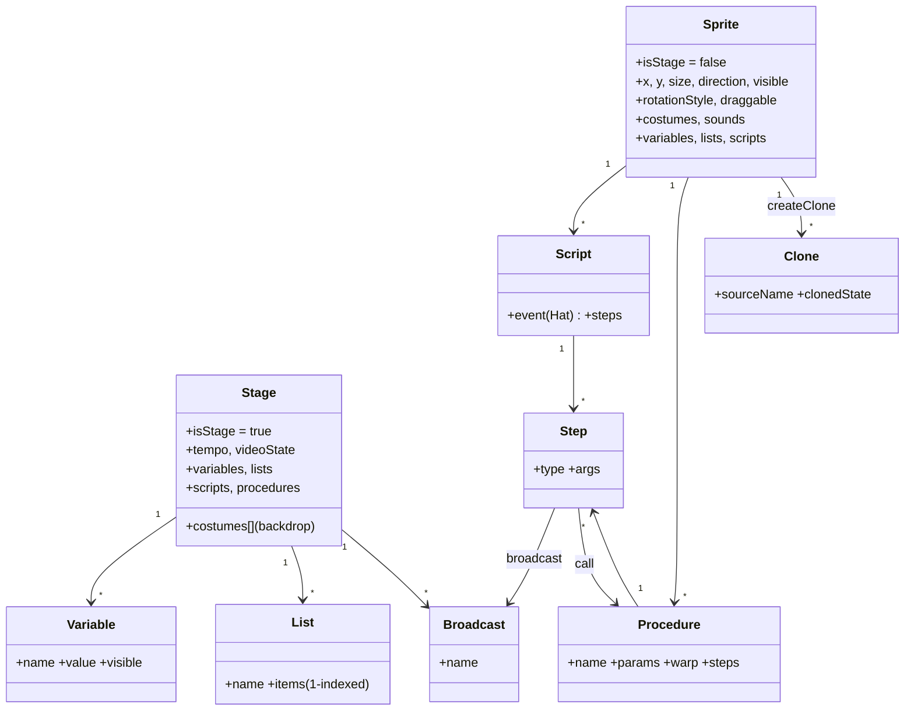
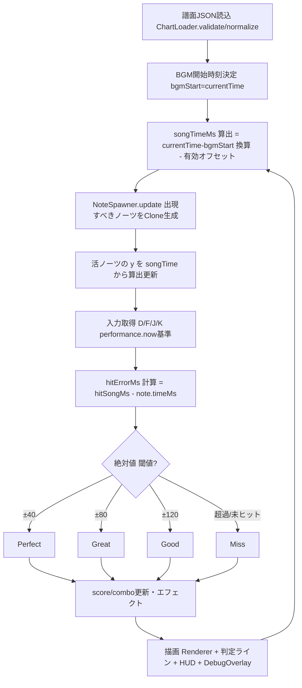
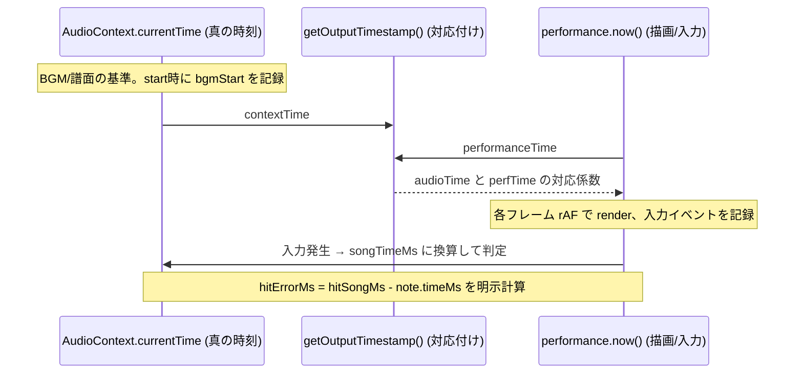

# Scratch互換 音ゲー基盤 — 設計・実装レポート

## エグゼクティブサマリ

Scratch 全体を再実装するのではなく、**音ゲーに必要な Scratch 互換サブセット**を HTML/JS 上に実装し、`中間DSL（JSON）を唯一の正本`として Web 実行系と Scratch 3.0 `.sb3` 生成系の両方を同じソースから導出する構成で構築した。実装は完了しており、動作する証拠は次のとおり。

- **テスト**: `node --test` で **157 テスト全パス（fail 0）**。ブロック実行・変数/リスト・broadcast and wait・クローン生存周期・譜面検証・タイミング・判定窓分類・DSL→Web・DSL→SB3 の 9 ファイルをカバー。
- **Web デモ（Chrome 実検証済み）**: DSL と譜面を fetch → `RhythmGame` 初期化 → 4 レーン縦スクロール。**Auto モードで全 12 ノーツ Perfect（SCORE 3600 / COMBO 12 / Miss 0）**、**手動入力 D/F/J/K で判定窓内ヒット時に 4/4 Perfect** を確認。
- **SB3 生成**: `generate-sb3.js` が Scratch VM 互換の `project.json`（targets/blocks/variables/lists/broadcasts/costumes/sounds）を生成し、`pack-sb3.js` が無圧縮(store)方式の自前 ZIP で `.sb3` を出力（実アセット未配置時はプレースホルダ SVG/WAV を合成し md5ext と整合）。dangling 参照ゼロ・`procedures_call` の proccode 整合を検証済み。
- **時刻設計**: 譜面・判定の真の時刻基準は `AudioContext.currentTime`、描画・入力ログは `performance.now()`、両者の対応付けに `getOutputTimestamp()` を用いる三層構成。

実装規模は engine/game/tools/web 合計で JavaScript 約 5,150 行。内部座標系は Scratch 標準の 480×360 に固定し、表示拡大は CSS のみで行う。



トレードオフとして、**音同期判定とノーツ移動はネイティブ JS で駆動**しており、Scratch の `ずっと` ループには載せていない。これは Scratch 互換性より音ゲーの成立性（サブミリ秒級の時刻基準）を優先した判断である。ノート種別は `tap` を実装し、`hold/flick/slide` はスキーマ上の予約に留めた。

---

## 1. アーキテクチャ概要

DSL を中心に、実行系と保存系を分岐させる。



- **engine/**: Scratch 風ランタイム。DSL の step/reporter を解釈し、変数・リスト・イベント・クローン・描画・音を提供。DOM/ブラウザ API はガードしており、**中核は Node でもヘッドレス動作**する（テスト可能）。
- **game/**: 音ゲー本体。`ChartLoader`/`JudgeSystem`/`NoteSpawner`/`RhythmGame`/`DebugOverlay`。
- **tools/**: DSL→sb3 変換、譜面検証、静的配信。
- **web/**: ブラウザ用エントリ（index.html / style.css / main.js）。

---

## 2. エンティティ関係図



DSL は `targets`（Stage + Sprite群）ベースで保持し、Scratch VM のシリアライザ構造へ素直に対応させている。

---

## 3. 処理フロー（音ゲーループ）



---

## 4. オーディオ同期タイムライン（三層時計）



設計上の要点:
- 真の時刻は `AudioContext.currentTime`（ハードウェア由来・単調増加）。`songTimeMs = (currentTime - bgmStart)*1000 - 有効オフセット`。
- **有効オフセット = chartOffsetMs + userOffsetMs + deviceCalibMs** の合算（`JudgeSystem.setOffsets`）。
- 描画・入力ログは `performance.now()`。`SoundBridge.getOutputTimestamp()` で両時計を対応付け、必要に応じて補正可能。
- BGM 音源が未配置でも AudioContext のクロックは進むため、`bgmStart` 記録だけで songTime は機能する（音は鳴らずとも判定・進行は成立）。ヘッドレスでは `performance.now` にフォールバック。

---

## 5. ブロック一覧（実装済み・主要 opcode 対応）

引数型は String / Number / Boolean を基本とする。reporter は `{op,...}` 形式、step は `{type,...}` 形式（詳細は `CONTRACT.md` §2/§3/§7）。

| カテゴリ | ブロック | DSL | sb3 opcode | 主な引数/フィールド |
|---|---|---|---|---|
| 動き | x座標を[X]にする | `setX` | motion_setx | X |
| 動き | x座標を[DX]ずつ変える | `changeX` | motion_changexby | DX |
| 動き | [SECS]秒でx:[X]y:[Y]へ行く | `glideTo` | motion_glidesecstoxy | SECS,X,Y |
| 動き | もし端に着いたら跳ね返る | `ifOnEdgeBounce` | motion_ifonedgebounce | — |
| 動き | x座標/y座標/向き(rep) | `xPos`/`yPos`/`direction` | motion_xposition 他 | — |
| 見た目 | 表示/隠す | `show`/`hide` | looks_show / looks_hide | — |
| 見た目 | コスチュームを[NAME]に | `switchCostume` | looks_switchcostumeto | COSTUME(影 looks_costume) |
| 見た目 | 大きさを[SIZE]%に | `setSize` | looks_setsizeto | SIZE |
| 見た目 | [MESSAGE]と言う | `say` | looks_say | MESSAGE |
| 見た目 | コスチュームの番号/名前(rep) | `costumeNumber/Name` | looks_costumenumbername | NUMBER_NAME |
| 音 | 音[SOUND]を鳴らす | `playSound` | sound_play | SOUND_MENU(影 sound_sounds_menu) |
| 音 | 音[SOUND]が終わるまで | `playSoundUntilDone` | sound_playuntildone | 同上 |
| 音 | すべての音を止める | `stopAllSounds` | sound_stopallsounds | — |
| 音 | 音量を[V]%に / 音量(rep) | `setVolume`/`volume` | sound_setvolumeto / sound_volume | VOLUME |
| イベント | 緑の旗が押されたとき(hat) | `green_flag` | event_whenflagclicked | — |
| イベント | [KEY]キーが押されたとき(hat) | `key_pressed` | event_whenkeypressed | KEY_OPTION |
| イベント | このスプライトが押されたとき(hat) | `sprite_clicked` | event_whenthisspriteclicked | — |
| イベント | 背景が[NAME]になったとき(hat) | `backdrop_switches` | event_whenbackdropswitchesto | BACKDROP |
| イベント | [MSG]を受け取ったとき(hat) | `receive` | event_whenbroadcastreceived | BROADCAST_OPTION |
| イベント | [MSG]を送る/送って待つ | `broadcast`/`broadcastAndWait` | event_broadcast / event_broadcastandwait | BROADCAST_INPUT |
| 制御 | [N]秒待つ | `wait` | control_wait | DURATION |
| 制御 | [N]回繰り返す/ずっと | `repeat`/`forever` | control_repeat / control_forever | TIMES,SUBSTACK |
| 制御 | もし<>なら(でなければ) | `if`/`ifElse` | control_if / control_if_else | CONDITION,SUBSTACK(2) |
| 制御 | <>まで待つ/繰り返す | `waitUntil`/`repeatUntil` | control_wait_until / control_repeat_until | CONDITION |
| 制御 | 止める[all/this/other] | `stop` | control_stop | STOP_OPTION(mutation) |
| 制御 | クローンを作る/このクローンを削除 | `createClone`/`deleteClone` | control_create_clone_of / control_delete_this_clone | CLONE_OPTION |
| 制御 | クローンされたとき(hat) | `clone_start` | control_start_as_clone | — |
| 調べる | マウスx/y・押された | `mouseX`/`mouseY`/`mouseDown` | sensing_mousex 他 | — |
| 調べる | [KEY]キーが押された(rep) | `keyPressed` | sensing_keypressed | KEY_OPTION(影 sensing_keyoptions) |
| 調べる | タイマー/タイマーをリセット | `timer`/`resetTimer` | sensing_timer / sensing_resettimer | — |
| 調べる | [T]までの距離 / [T]に触れた | `distanceTo`/`touching` | sensing_distanceto / sensing_touchingobject | (影メニュー) |
| 調べる | [Q]と聞いて待つ / 答え | `askAndWait`/`answer` | sensing_askandwait / sensing_answer | QUESTION |
| 演算 | 四則・mod・比較 | `add/sub/mul/div/mod/lt/eq/gt` | operator_add 他 | NUM1/NUM2, OPERAND1/2 |
| 演算 | かつ/または/ではない | `and`/`or`/`not` | operator_and/or/not | OPERAND |
| 演算 | 乱数・連結・文字・長さ・含む | `random/join/letterOf/lengthOf/contains` | operator_random 他 | — |
| 演算 | 四捨五入 / 数学関数 | `round`/`mathop` | operator_round / operator_mathop | NUM, OPERATOR |
| 変数 | [VAR]にする/ずつ変える/表示/隠す | `set`/`change`/`showVar`/`hideVar` | data_setvariableto 他 | VALUE, VARIABLE |
| リスト | 追加/削除/挿入/置換/取得/位置/長さ/含む | `listAdd` 他 | data_addtolist 他 | ITEM,INDEX, LIST |
| ブロック定義 | 定義/呼出/引数 | `procedure`/`call`/`arg` | procedures_definition/_call, argument_reporter_* | mutation(proccode 等) |

リスト演算はすべて 1-indexed。`eq/lt/gt` と list の `indexOf/contains` は Scratch 流の比較（数値文字列は数値比較、文字列は大文字小文字無視）を実装。

---

## 6. ファイル構成

| ディレクトリ | ファイル | 役割 |
|---|---|---|
| spec/ | scratch-rhythm.dsl.json | DSL 正本（実例）|
| spec/ | chart.schema.json / sample-chart.json | 譜面スキーマ（draft-07）と実例 |
| engine/ | VariableStore.js / ListStore.js | 変数・1-indexed リスト（モニタ表示フラグ付き）|
| engine/ | EventBus.js | 汎用 pub/sub |
| engine/ | SpriteRuntime.js / StageRuntime.js | スプライト/ステージ状態・メソッド |
| engine/ | Interpreter.js | DSL step/reporter 実行（generator）|
| engine/ | ThreadRunner.js | 協調マルチタスク（Thread/ThreadRunner）|
| engine/ | CloneManager.js | クローン生成/削除・clone_start 起動 |
| engine/ | SoundBridge.js | Web Audio（decode/再生/クロック対応）|
| engine/ | Input.js | 入力（物理キー→Scratchキー名変換）|
| engine/ | Renderer.js | Canvas 480×360 描画（未ロードはプレースホルダ）|
| engine/ | PenCompat.js | ペン互換（デバッグ描画）|
| engine/ | Runtime.js / index.js | オーケストレータ / re-export |
| game/ | ChartLoader.js | 譜面 validate/normalize/load |
| game/ | JudgeSystem.js | オフセット合算・判定窓分類 |
| game/ | NoteSpawner.js | ノーツ出現・y更新・consume |
| game/ | RhythmGame.js | 本体（init/start/onLaneHit/songTimeMs/Auto）|
| game/ | DebugOverlay.js | FPS/clone/時計ズレ/散布図/ログ |
| tools/ | validate-chart.js | 譜面検証 CLI + `validateChart()` |
| tools/ | generate-sb3.js | `Sb3Generator`（DSL→project.json）|
| tools/ | pack-sb3.js | .sb3(zip) パッケージング（自前 store-zip + md5）|
| tools/ | generate-web.js / serve.js | DSL 検証/配信 |
| web/ | index.html / style.css / main.js | ブラウザエントリ |
| tests/ | *.test.js（9本）| `node --test` 用テスト |

---

## 7. 譜面 JSON スキーマ

| キー | 型 | 必須 | 説明 |
|---|---|---|---|
| version | string("1.0") | ✓ | スキーマ版 |
| meta.title | string | ✓ | 曲名 |
| meta.artist | string | | アーティスト |
| meta.bpm | number(>0) | ✓ | 基本 BPM |
| meta.offsetMs | number | ✓ | 譜面全体オフセット |
| meta.lanes | integer(1-8) | ✓ | レーン数 |
| audio.file | string | ✓ | BGM ファイル |
| audio.previewStartMs | number | | プレビュー開始 |
| timing.perfectMs/greatMs/goodMs | number(>0) | | 曲別判定補正 |
| notes[].id | string | ✓ | 一意 ID |
| notes[].timeMs | number(≥0) | ✓ | 発音基準絶対時刻 |
| notes[].lane | integer(≥0) | ✓ | 0-based lane |
| notes[].type | enum(tap/hold/flick/slide) | ✓ | ノート種別 |
| notes[].endTimeMs | number | 条件 | hold 用終端 |
| notes[].sfx | string | | 個別効果音 |

`ChartLoader.normalize` は notes を `timeMs` 昇順で安定ソートし、欠落既定値を補完する。

---

## 8. 判定閾値

| 判定 | 条件（hitErrorMs の絶対値） | 既定 |
|---|---|---|
| Perfect | ≤ perfectMs | ±40 ms |
| Great | ≤ greatMs | ±80 ms |
| Good | ≤ goodMs | ±120 ms |
| Miss | goodMs 超過 / 未ヒット通過 | — |

`JudgeSystem` のコンストラクタおよび譜面 `timing` で**変更可能**。`hit-window.test.js` で境界値（±40/±80/±120 の内外）を網羅検証済み。

---

## 9. アセット仕様

| 種別 | 必須プロパティ | 受理形式 | 命名規則例 |
|---|---|---|---|
| コスチューム/背景 | name, bitmapResolution, dataFormat, assetId, md5ext, rotationCenterX, rotationCenterY | .svg/.png/.bmp/.jpg/.jpeg/.gif | `spr_note_tap_blue_v01.png` / `stg_play_bg_v01.png` |
| 音（BGM/効果音）| name, assetId, dataFormat, format, rate, sampleCount, md5ext | .wav/.mp3 | `bgm_song_main_160bpm_v01.wav` / `sfx_hit_perfect_v01.wav` |
| ステージ | tempo, videoTransparency, videoState, textToSpeechLanguage | — | — |
| スプライト | visible, x, y, size, direction, draggable, rotationStyle | — | — |

内部座標 480×360 基準。`pack-sb3.js` はアセット実在時は md5 を実体に一致させ、未配置時はプレースホルダ（最小 SVG / 極短 WAV）を合成して `md5ext` と ZIP エントリ名を一致させる。

---

## 10. 変換方針

### 10.1 DSL → HTML/JS
- Stage → `StageRuntime`、Sprite → `SpriteRuntime`、variables/lists → `VariableStore`/`ListStore`。
- scripts → `ThreadRunner` の generator スレッド。`forever` はフレームループ（各反復で最低 1 回 yield）。
- broadcast → 受信 hat スレッド起動。`broadcastAndWait` は受信スレッド全終了まで送信側を待機（`{type:'waitThreads'}` を yield）。
- clone → `CloneManager`（生成時に `clone_start` 起動、`deleteClone` でスレッド停止＋除去）。

### 10.2 DSL → .sb3
target ごとに `isStage` を設定し、`variables/lists/broadcasts/blocks/costumes/sounds` を充填。各 block は Scratch VM 互換の形:

```
{ opcode, next, parent, inputs, fields, shadow, topLevel, (x,y for topLevel), (mutation) }
```

入力は影付き数値 `[1,[4,"10"]]`、ブロック入力 `[2,"<id>"]`、変数差込 `[3,[12,name,id],[10,""]]`、SUBSTACK `[2,"<子id>"]` 等を生成。broadcast は Stage scope に保存。変数/リスト/ブロック ID は name から決定的に採番（衝突回避）。

---

## 11. 生成された sb3 の実例（抜粋）

`spec/scratch-rhythm.dsl.json` を `generate-sb3.js` で変換した `dist/project.json` の実値:

```jsonc
// Stage の broadcasts と変数（id:[name,value]）
"broadcasts": { "bc-song_start":"song_start", "bc-spawn_note":"spawn_note", "bc-note_judged":"note_judged" },
"variables": { "var-Stage-score":["score",0], "var-Stage-combo":["combo",0], "var-Stage-maxCombo":["maxCombo",0], "var-Stage-fps":["fps",0] }

// 緑の旗ハット（topLevel）
"blk-10": { "opcode":"event_whenflagclicked", "next":"blk-11", "parent":null,
            "inputs":{}, "fields":{}, "shadow":false, "topLevel":true, "x":0, "y":200 }

// 「maxCombo を combo にする」= 変数差込 [3,[12,...],[10,""]]
"blk-9": { "opcode":"data_setvariableto", "next":null, "parent":"blk-6",
           "inputs":{ "VALUE":[3,[12,"combo","var-Stage-combo"],[10,""]] },
           "fields":{ "VARIABLE":["maxCombo","var-Stage-maxCombo"] },
           "shadow":false, "topLevel":false }
```

`meta` は `{"semver":"3.0.0","vm":"2.3.4","agent":"htmlJs2sb3"}`。targets は `Stage(stage), Note(sprite)`。`pack-sb3.js` 実行で `.sb3` は `project.json` + 各 `md5ext` アセット（プレースホルダ）の 3 エントリ ZIP となる。

---

## 12. DSL / chart の具体例（実ファイル）

DSL（`spec/scratch-rhythm.dsl.json` 抜粋）— 緑の旗で song_start を送って待ち、Note を 4 回クローン:

```json
{ "event": { "type": "green_flag" }, "steps": [
  { "type": "set", "var": "score", "value": 0 },
  { "type": "broadcastAndWait", "name": "song_start" },
  { "type": "broadcast", "name": "spawn_note" } ] }
```

chart（`spec/sample-chart.json` 抜粋）:

```json
{ "version":"1.0",
  "meta": { "title":"Test Song", "bpm":160, "offsetMs":-12, "lanes":4 },
  "audio": { "file":"assets/audio/bgm_song_main_160bpm_v01.wav" },
  "timing": { "perfectMs":40, "greatMs":80, "goodMs":120 },
  "notes": [ { "id":"n0001", "timeMs":1000, "lane":0, "type":"tap" } ] }
```

---

## 13. テスト計画（実装済み・全パス）

| テスト | 保証する内容 |
|---|---|
| block-execution | set/change/if/repeat/演算 reporter/手続き呼出の実行結果 |
| variable-list | Store API・1-indexed・範囲外挙動・Scratch 等価比較 |
| broadcast-and-wait | 受信完了まで送信側が進まない順序保証 |
| clone-lifecycle | createClone/clone_start/deleteClone と clone 数増減 |
| chart-validation | 必須欠落/型不正/lane 負値/version 不一致のエラー検出 |
| timing-drift | 有効オフセット合算と hitErrorMs シフト |
| hit-window | 判定窓境界（±40/±80/±120 の内外）分類 |
| dsl-to-html | loadProject の構築健全性・数百フレーム例外なし実行 |
| dsl-to-sb3 | project.json 構造・dangling 参照ゼロ・proccode 整合 |

実行: `node --test`（157/157 pass）。補助として `engine/_smoke.mjs`・`game/_smoke.mjs`・`tools/_verify.mjs` が手動スモーク用に存在。

---

## 14. デバッグ計画（DebugOverlay）

`Debug` ボタンで切替。表示項目: FPS、生存 clone 数（total/active）、`AudioContext.currentTime` と `performance.now()` のズレ、各入力の `hitErrorMs` 散布図、直近イベントログ（broadcast/judge）、リストダンプ。文字列ログだけでなく可視化を備えることで、時計ズレと判定誤差を直感的に追える。

---

## 15. パフォーマンス方針

- 毎フレームで JSON を parse しない（DSL は起動時 1 回解釈、以後はランタイムオブジェクト）。
- ノーツは判定用配列と描画用を分離し、`NoteSpawner` で活ノーツのみ更新。clone は CloneManager でプール再利用余地あり。
- 音 asset は事前 decode（`SoundBridge.loadAll`）。開始無音・decode 遅延を見越したプリロード。
- 内部解像度 480×360 を維持し、見た目の拡大は CSS（`image-rendering: pixelated`）のみ。

---

## 16. 実装ロードマップと達成状況

| # | 項目（req 推奨順）| 状況 |
|---|---|---|
| 1 | ランタイム骨格（Stage/Sprite/Variable/List）| ✅ 完了 |
| 2 | EventBus / ThreadRunner | ✅ 完了 |
| 3 | 変数・リスト | ✅ 完了 |
| 4 | 動き・見た目・音のコアブロック | ✅ 完了 |
| 5 | ChartLoader | ✅ 完了 |
| 6 | SoundBridge | ✅ 完了 |
| 7 | JudgeSystem | ✅ 完了 |
| 8 | CloneManager | ✅ 完了 |
| 9 | DebugOverlay | ✅ 完了 |
| 10 | SB3Generator | ✅ 完了 |
| 11 | pack-sb3 | ✅ 完了（自前 store-zip）|
| 12 | テスト | ✅ 完了（157 pass）|

---

## 17. 既知の制約と今後の拡張

- **実アセット未同梱**: 画像/音はプレースホルダ描画・合成で動作。実ファイルを `assets/` に置けば Renderer/SoundBridge/pack-sb3 が自動的に実体（実 md5）へ差し替える。
- **ノート種別**: `tap` を実装。`hold/flick/slide` はスキーマ予約。`endTimeMs` を用いた hold の判定・描画は今後の拡張。
- **音同期はネイティブ駆動**: ノーツ移動と判定は精度のため JS で駆動し、Scratch の `ずっと` には載せていない。sb3 へエクスポートした場合、Scratch 上ではブロックレベルの近似挙動になる（サブミリ秒判定は Scratch VM の制約上再現しない）。
- **モニタ UI**: 変数/リストのモニタ表示フラグは保持するが、Scratch GUI 相当のリッチなモニタ描画は簡易表示に留めた。
- **sb3 の往復**: `.sb3` は Scratch 3.0 が読み込める構造（targets/blocks/assets）を出力するが、Scratch → DSL の逆変換（インポート）は対象外。

## 実行方法（参考）

```bash
node --test                                   # テスト（157/157）
node tools/validate-chart.js spec/sample-chart.json
node tools/generate-sb3.js spec/scratch-rhythm.dsl.json dist/project.json
node tools/pack-sb3.js spec/scratch-rhythm.dsl.json dist/scratch-rhythm.sb3
node tools/serve.js 8123                       # → http://localhost:8123/web/index.html
```
