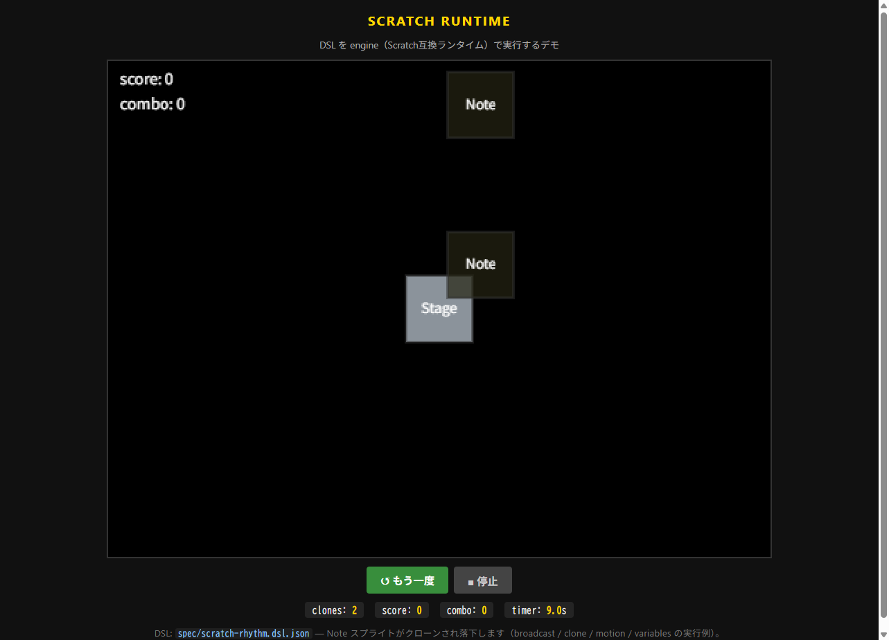
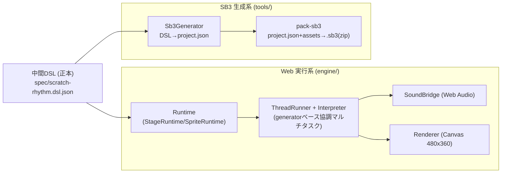
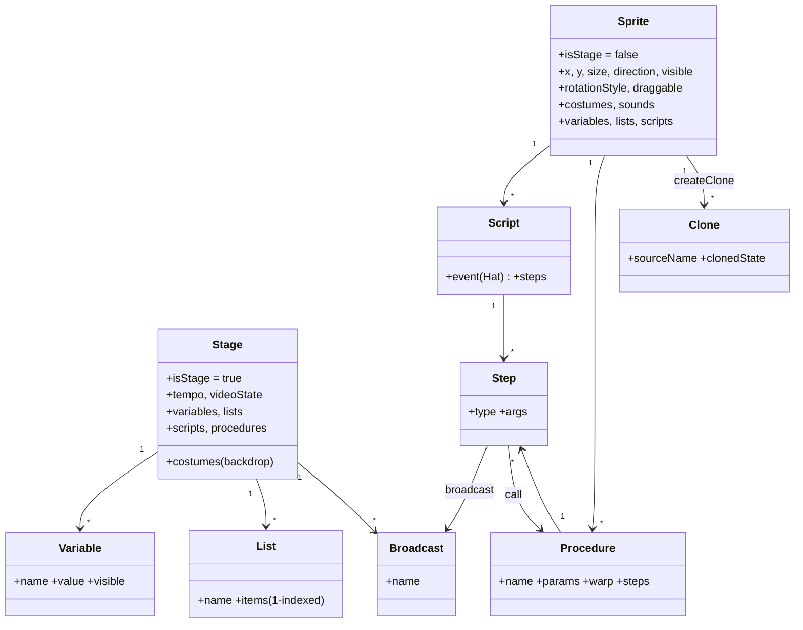
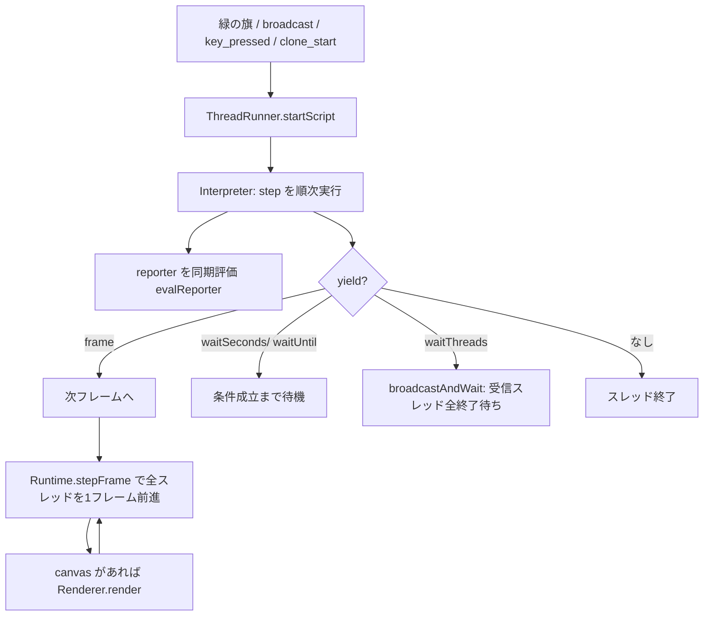

# Scratch互換ランタイムシステム — 設計・実装レポート

## エグゼクティブサマリ

Scratch 全体を再実装するのではなく、**Scratch 互換の最小サブセット**を HTML/JS で実装し、
`中間DSL（JSON）を唯一の正本`として、ブラウザ実行系（engine）と Scratch 3.0 `.sb3` 生成系（tools）の
両方を同じソースから導出する「型（システム）」を構築した。本ブランチ（`scratch-system`）は、
この再利用可能なランタイム基盤だけを残し、音ゲー固有部分（判定・譜面・ノーツ生成）を取り除いた構成である。

- **ランタイム**: 10 カテゴリ（動き/見た目/音/イベント/制御/調べる/演算/変数/リスト/ブロック定義）の
  Scratch 互換ブロックを generator ベースの協調マルチタスクで実行。リストは 1-indexed、
  `eq/lt/gt` は Scratch 流比較。`broadcastAndWait`・クローン・カスタムブロックに対応。
- **DSL → .sb3**: `Sb3Generator` が Scratch VM 互換の `project.json`
  （targets/blocks/variables/lists/broadcasts/costumes/sounds）を生成し、`pack-sb3` が無圧縮(store)方式の
  自前 ZIP で `.sb3` を出力（実アセット未配置時はプレースホルダを合成し md5ext と整合）。
- **検証**: `node --test` で **engine/変換系のテスト全パス**、Chrome で Web デモ（DSL を engine で実行）を動作確認。
- 内部座標は Scratch 標準 480×360 固定、表示拡大は CSS のみ。engine 中核は DOM 非依存で Node でもヘッドレス動作する。



上図は Web デモで DSL を実行した様子。`green_flag → broadcastAndWait → broadcast(spawn_note) →`
Note スプライトの `createClone` → `clone_start` の `forever` で落下、という Scratch 互換の
broadcast / clone / motion / variables の連携が動作している（変数モニタ score/combo も表示）。

---

## 1. アーキテクチャ

DSL を中心に、実行系と保存系を分岐させる。



- **engine/**: Scratch 風ランタイム。DSL の step/reporter を解釈し、変数・リスト・イベント・クローン・描画・音を提供。
  `document`/`window`/`AudioContext`/`requestAnimationFrame` はガードしており、中核は Node でテスト可能。
- **tools/**: DSL→sb3 変換、DSL 検証、静的配信。
- **web/**: ブラウザ用エントリ（DSL を `Runtime` で実行）。

---

## 2. エンティティ関係図



DSL は `targets`（Stage + Sprite群）ベースで保持し、Scratch VM のシリアライザ構造へ素直に対応させている。

---

## 3. スレッド実行モデル（DSL の実行）

scripts はハット種別ごとに generator スレッド化され、`ThreadRunner` が毎フレーム yield まで進める。



`forever`/`repeat`/`repeatUntil` は各反復で最低 1 回 yield し、フレームループの応答性を保つ。
クローンは `CloneManager` が生成時に `clone_start` ハットを起動し、`deleteClone` でスレッド停止＋除去する。

---

## 4. ブロック一覧（実装済み・主要 opcode 対応）

reporter は `{op,...}` 形式、step は `{type,...}` 形式（詳細は `CONTRACT.md` §2/§3/§6）。

| カテゴリ | ブロック | DSL | sb3 opcode |
|---|---|---|---|
| 動き | x/y にする・ずつ変える | `setX/setY/changeX/changeY` | motion_setx 他 |
| 動き | 向ける・glide・端で跳ね返る | `pointInDirection/glideTo/ifOnEdgeBounce` | motion_pointindirection 他 |
| 動き | x座標/y座標/向き(rep) | `xPos/yPos/direction` | motion_xposition 他 |
| 見た目 | 表示/隠す・コスチューム・大きさ・層・言う | `show/hide/switchCostume/setSize/changeLayer/say` | looks_show 他 |
| 音 | 鳴らす・終わるまで・止める・音量 | `playSound/playSoundUntilDone/stopAllSounds/setVolume` | sound_play 他 |
| イベント | 緑の旗/キー/クリック/背景/受信(hat) | `green_flag/key_pressed/sprite_clicked/backdrop_switches/receive` | event_whenflagclicked 他 |
| イベント | 送る・送って待つ | `broadcast/broadcastAndWait` | event_broadcast / event_broadcastandwait |
| 制御 | 待つ/繰り返す/ずっと/もし/まで/止める | `wait/repeat/forever/if/ifElse/waitUntil/repeatUntil/stop` | control_wait 他 |
| 制御 | クローン作成/開始(hat)/削除 | `createClone/clone_start/deleteClone` | control_create_clone_of 他 |
| 調べる | マウス/キー/タイマー/距離/接触/質問/答え | `mouseX/keyPressed/timer/distanceTo/touching/askAndWait/answer` | sensing_mousex 他 |
| 演算 | 四則・比較・論理・乱数・文字列・丸め・数学関数 | `add/lt/and/random/join/round/mathop` 他 | operator_add 他 |
| 変数 | にする/ずつ変える/表示/隠す | `set/change/showVar/hideVar` | data_setvariableto 他 |
| リスト | 追加/削除/挿入/置換/取得/位置/長さ/含む | `listAdd/listDeleteAt/listGet` 他 | data_addtolist 他 |
| ブロック定義 | 定義/呼出/引数 | `procedure/call/arg` | procedures_definition/_call, argument_reporter_* |

リスト演算はすべて 1-indexed。`eq/lt/gt` と list の `indexOf/contains` は Scratch 流比較
（数値文字列は数値比較、文字列は大文字小文字無視）。

---

## 5. ファイル構成

| ディレクトリ | ファイル | 役割 |
|---|---|---|
| spec/ | scratch-rhythm.dsl.json | DSL 正本（実例）|
| engine/ | VariableStore.js / ListStore.js | 変数・1-indexed リスト（モニタ表示フラグ）|
| engine/ | EventBus.js | 汎用 pub/sub |
| engine/ | SpriteRuntime.js / StageRuntime.js | スプライト/ステージ状態・メソッド |
| engine/ | Interpreter.js | DSL step/reporter 実行（generator）|
| engine/ | ThreadRunner.js | 協調マルチタスク |
| engine/ | CloneManager.js | クローン生成/削除・clone_start 起動 |
| engine/ | SoundBridge.js | Web Audio（decode/再生/クロック対応）|
| engine/ | Input.js | 入力（物理キー→Scratchキー名）|
| engine/ | Renderer.js | Canvas 480×360 描画（未ロードはプレースホルダ）|
| engine/ | PenCompat.js | ペン互換（デバッグ描画）|
| engine/ | Runtime.js / index.js | オーケストレータ / re-export |
| tools/ | generate-sb3.js | `Sb3Generator`（DSL→project.json）|
| tools/ | pack-sb3.js | .sb3(zip) パッケージング（自前 store-zip + md5）|
| tools/ | generate-web.js / serve.js | DSL 検証 / 静的配信 |
| web/ | index.html / style.css / main.js | ブラウザデモ（DSL を Runtime で実行）|
| tests/ | *.test.js | `node --test` 用テスト |

---

## 6. 変換方針

### 6.1 DSL → HTML/JS
- Stage → `StageRuntime`、Sprite → `SpriteRuntime`、variables/lists → `VariableStore`/`ListStore`。
- scripts → `ThreadRunner` の generator スレッド。`forever` はフレームループ（各反復で最低 1 回 yield）。
- broadcast → 受信 hat スレッド起動。`broadcastAndWait` は受信スレッド全終了まで送信側を待機。
- clone → `CloneManager`（生成時に `clone_start` 起動、`deleteClone` でスレッド停止＋除去）。

### 6.2 DSL → .sb3
target ごとに `isStage` を設定し、`variables/lists/broadcasts/blocks/costumes/sounds` を充填。各 block は
Scratch VM 互換の形:

```
{ opcode, next, parent, inputs, fields, shadow, topLevel, (x,y for topLevel), (mutation) }
```

入力は影付き数値 `[1,[4,"10"]]`、ブロック入力 `[2,"<id>"]`、変数差込 `[3,[12,name,id],[10,""]]`、
SUBSTACK `[2,"<子id>"]` 等を生成。broadcast は Stage scope に保存。変数/リスト/ブロック ID は
name から決定的に採番（衝突回避）。

---

## 7. 生成された sb3 の実例（抜粋）

`spec/scratch-rhythm.dsl.json` を `generate-sb3.js` で変換した `dist/project.json` の実値:

```jsonc
"broadcasts": { "bc-song_start":"song_start", "bc-spawn_note":"spawn_note", "bc-note_judged":"note_judged" },
"variables": { "var-Stage-score":["score",0], "var-Stage-combo":["combo",0] }

// 緑の旗ハット（topLevel）
"blk-10": { "opcode":"event_whenflagclicked", "next":"blk-11", "parent":null,
            "inputs":{}, "fields":{}, "shadow":false, "topLevel":true, "x":0, "y":200 }

// 「maxCombo を combo にする」= 変数差込 [3,[12,...],[10,""]]
"blk-9": { "opcode":"data_setvariableto", "next":null, "parent":"blk-6",
           "inputs":{ "VALUE":[3,[12,"combo","var-Stage-combo"],[10,""]] },
           "fields":{ "VARIABLE":["maxCombo","var-Stage-maxCombo"] },
           "shadow":false, "topLevel":false }
```

`meta` は `{"semver":"3.0.0","vm":"2.3.4","agent":"htmlJs2sb3"}`。targets は `Stage(stage), Note(sprite)`。
`pack-sb3.js` 実行で `.sb3` は `project.json` + 各 `md5ext` アセット（プレースホルダ）の ZIP となる。

---

## 8. テスト

`node --test` で実行。

| テスト | 保証する内容 |
|---|---|
| block-execution | set/change/if/repeat/演算 reporter/手続き呼出の実行結果 |
| variable-list | Store API・1-indexed・範囲外挙動・Scratch 等価比較 |
| broadcast-and-wait | 受信完了まで送信側が進まない順序保証 |
| clone-lifecycle | createClone/clone_start/deleteClone と clone 数増減 |
| dsl-to-html | loadProject の構築健全性・数百フレーム例外なし実行 |
| dsl-to-sb3 | project.json 構造・dangling 参照ゼロ・proccode 整合 |

補助として `engine/_smoke.mjs`・`tools/_verify.mjs` が手動スモーク用に存在。

---

## 9. パフォーマンス方針

- 毎フレームで JSON を parse しない（DSL は起動時 1 回解釈、以後はランタイムオブジェクト）。
- 描画用と判定用のデータを分離する設計を維持（音ゲー層を載せる際の前提）。
- 音 asset は事前 decode（`SoundBridge.loadAll`）。
- 内部解像度 480×360 を維持し、見た目の拡大は CSS（`image-rendering: pixelated`）のみ。

---

## 10. このブランチの範囲と拡張余地

- **含む**: Scratch 互換ランタイム（engine）、DSL 正本、DSL→sb3 変換（tools）、ブラウザデモ（web）、テスト。
- **含まない（main ブランチにある）**: 音ゲー本体（`JudgeSystem`/`NoteSpawner`/`RhythmGame`/`DebugOverlay`/`ChartLoader`）、
  譜面スキーマ・サンプル、判定窓・タイミングのテスト。
- **拡張余地**: このシステム上に任意の Scratch 風アプリ（音ゲー含む）を DSL とネイティブ補助層で構築できる。
  `SoundBridge` は `AudioContext.currentTime` / `getOutputTimestamp()` を提供しており、
  高精度な時刻同期が必要なアプリの土台になる。

## 実行方法（参考）

```bash
node --test
node tools/generate-sb3.js spec/scratch-rhythm.dsl.json dist/project.json
node tools/pack-sb3.js spec/scratch-rhythm.dsl.json dist/scratch-rhythm.sb3
node tools/serve.js 8123        # → http://localhost:8123/web/index.html
```
